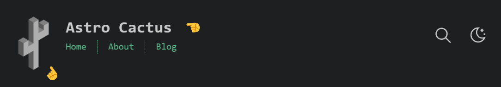
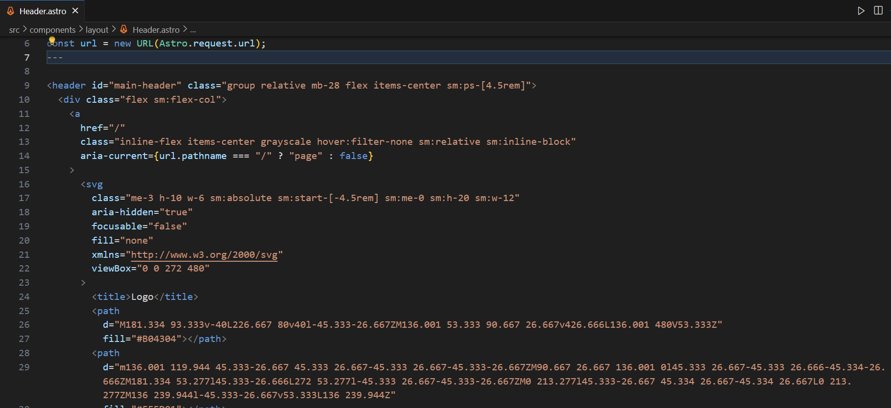
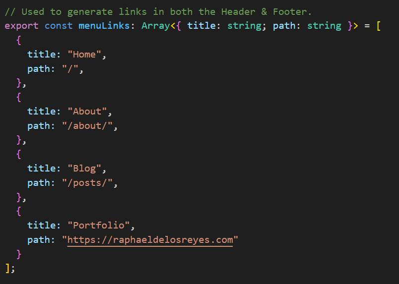
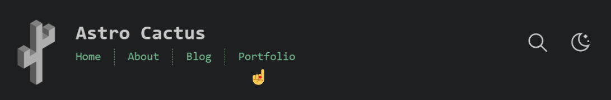
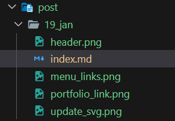

## Why Astro?

If, like me, you want to share your software projects, learning, or insights through a blog, your first instict likely would have been to code it up from scratch yourself. It was mine.

I wanted to build it at the software level and deploy it under my subdomain.

However this would have shifted the effort towards making the blog, later to the maintenance of the code, with little time to write.

On the other hand I didn't want to opt for a no code solution, since I want to have software-level control of the layout and functionality.

A great middleground is to use the Astro framework with a theme. It's very quick to set up yet still flexible. I was able to build out this blog, make basic modifications, and deploy in one night by using a template.

Now I'm able to focus on writing and still make modifications to the code if I choose.

In the next few minutes, I'll walk through the steps I took to set this up. For more information, visit https://astro.build/.

### 1. Choose a theme

Go to the Astro website https://astro.build/. On the navbar, click the **Resources** dropdown and click **Themes**. 

Or go to this link: https://astro.build/themes/.

Spend some time checking out the different themes and pick your favorite. For this blog I chose the **Astro Cactus Theme**: https://astro.build/themes/details/astro-cactus/

### 2. Install

  Click **Get started** on your theme page. This takes you to the github repo of the theme which should have all the info needed for the build. For the rest of this post, I'll be talking about the **Astro Cactus Theme**.

  Navigate to your desired directory and run the following command:

  ```shell
  npm create astro@latest -- --template chrismwilliams/astro-theme-cactus
  ```

  NOTE: If you want to install the packages in the current directory, instead of making a new folder in this directory, run the following command:

  ```shell
  npm create astro@latest -- --template chrismwilliams/astro-theme-cactus ./
  ```

  Follow the prompts. Install the dependencies.

  ### 2. Configuration

  Start the server to view the theme.
  
  ```shell
  npm run dev
  ```

  1. Edit the site metadata at `src/site.config.ts`.

  2. Add your own favicon and assets to the `public/` folder.

  3. Add your own `manifest.webmanifest` in the `public/` folder.
  
     I used [favicon.io](https://favicon.io/) to generate a `favicon.ico` from an image. You can download the generated assets as well as the `manifest.webmanifest` for free.

  4. Add your socials and links in `src/components/SocialList.astro`.
  
     For more detailed configuration steps for the Astro Cactus Theme, please see its [readme](https://github.com/chrismwilliams/astro-theme-cactus).

  ### 3. Other modifications

  1. Update the Cactus logo and title in the header.

     
   
     In the `src/components/layout/Header.astro`, change the svg inside the `<a></a>` tag to your own logo.

     

     Update the text inside the `<span></span>` to your own title.

  2. In the `src/pages/` folder, update `index.astro`, `about.astro`, and if you want, `404.astro`. 

  3. Add your own links in the header.
  
     Navigate to `site.config.ts` and modify the `menuLinks` export.

     

     


The blog can be customized further. More importantly, now you can focus on writing.

To make a post, simply make a folder under `src/content/post` and create an `index.md` file. Add any images for the post in this folder as well.



### Summary 

Using the Astro framework with a theme allowed me to quickly set up a coding blog without getting bogged down building it from scratch. And while quick to set up, it's still highly customizable.

After I finished setting up this blog, I deployed it on Netlify and made it accessible through my subdomain [blog.raphaeldelosreyes.com](https://blog.raphaeldelosreyes.com).

I'll make another post detailing these steps in the future.

