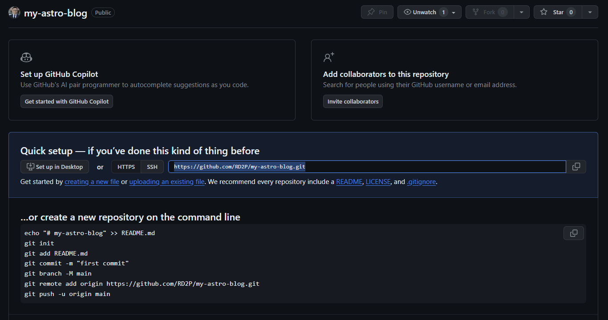
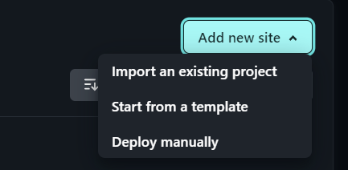
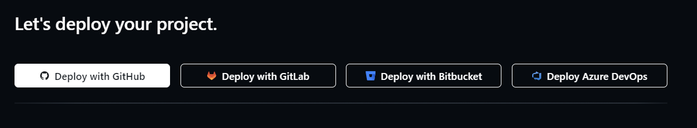
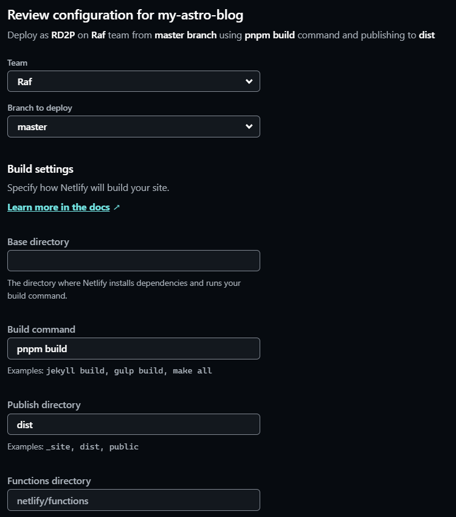
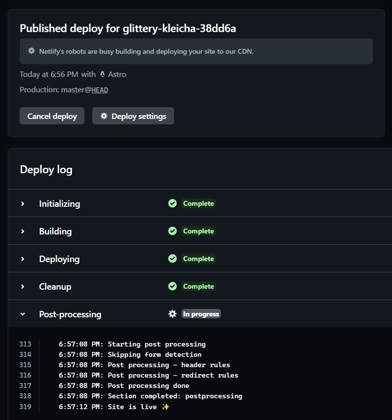

This post is a continuation of the [previous guide](https://blog.raphaeldelosreyes.com/posts/19_jan/) on creating an Astro project for a coding blog.

Though where that blog post detailed the steps to configure and modify an Astro theme, this one will focus on deploying the project online.

## 1. Why Netlify?

Netlify is the simplest platform I've seen so far when it comes to deploying small sites. They have a great free tier that's probably able to support most of your personal projects.

To use the platform is simple: just connect your Netlify account to your GitHub, and they can handle the building and deploying directly from your repositories. And every time you push code to GitHub, Netlify automatically rebuilds your site and republishes it with the latest commit.

But before you set things up with Netlify in this way, you must first push your code to Github.

## 2. Push your code to GitHub

If you don't need help making a GitHub repo, jump to [Making a Netlify](#3-make-a-netlify-account) account.

### a. Initialize your project as a local git repo

If you haven't initialized  your Astro project as a local git repo, open your the Astro blog folder in the terminal and run the following commands:

  ```shell
  git init
  git add .
  git commit -m "initialize Astro project"
  ```
### b. Create a GitHub repository

Log in to [GitHub](https://github.com/) and go to your **Repositories** page.

Click **New** to create a new repo.


<!--  -->

Fill in the fields.

### c. Connect your local repository to GitHub

Once your repo has been created, copy the https link.



Back to your project terminal, connect your local Astro project to the GitHub repo you just created by running the following command:

  ```shell
  git remote add origin [your-repo-link]
  ```

  Example:

  ```shell
  git remote add origin https://github.com/RD2P/my-astro-blog.git
  ```
Now push your code from your machine to GitHub with:

```shell
git push -u origin master
```

This command pushes the local "master" branch to the "origin" remote repository and set it as the upstream branch.

The `-u` flag is short for `--set-upstream`, which establishes a tracking relationship between the local and remote branches. This allows you to use git pull without specifying the remote and branch.

After running this command, you can simply use `git push` and `git pull` without providing the remote and branch names.

Your code should now be on GitHub.
  
## 3. Make a Netlify account

Go to [Netlify.com](https://www.netlify.com/) and sign up. 

Click **Sign up with GitHub**. This connects your Netlify account to GitHub and allows you to deploy your projects on Netlify directly from your GitHub repos.

Fill in the required fields and set up your team space. A starter team space is enough for this purpose, no need to opt in to the Pro plan.

## 4. Deploy your first project

Go to your team overview and click **Add new site**. Then you can choose **Import and existing project**.



On the following page, choose **Deploy with GitHub**.



You will need to authorize Netlify to access your GitHub repos.

On the last step, review the deploy configuration.



Netlify is usually very good with properly filling in the fields based on your project. You shouldn't have to change anything here.

Wait a bit and your site should be live!



## 5. Summary 

I chose Netlify for deployment because it was simple. And with the CI/CD ability, the process of writing and publishing blogs becomes very easy. All I need to do is write a post and push to GitHub, and Netlify will automatically publish the site with the new post.

Notice above that the deployed site has a URL generated by Netlify that ends with `.netlify.app`. However the blog you're currently reading has the URL `blog.raphaeldelosreyes.com`.

That's because after I deployed this blog, I rerouted traffic going to a subdomain that I own to go to the URL generated by Netlify.

My next post will be all about this process with the usual detailed steps, examples, and pictures to help you do the same.

Stay tuned 👋